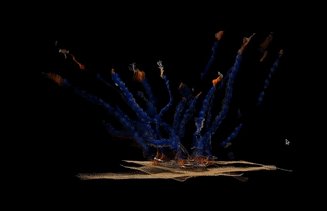

# #Blocked
This is the final group project for ME495 Fall 2020 at Northwestern University  
Authors: Arun Kumar, Bowen Feng, Nicole Baptist, Tianyu Li, Yen Chin Loke

<br />

# Overview

## Introduction
This project creates an automated system for reconstructing objects with point clouds. The hardware for this system includes a Rethink Sawyer robot arm and a RealSense camera as the end-effector, and a turtlebot3 (burger).

The turtlebot3 is used as a turntable to allow the RealSense camera to record point cloud data for the object. The Sawyer robot arm is used to control the position and the viewing angle of the camera. 

In the current version, our system will record point cloud from four sides and the top view of the object to recontruct its point cloud.  

## File structure
```
--final-project-blocked
  --arm_motion
  --camera_motion
  --camera_reconstruct
```

## Quickstart Guide
### Setup the workspace
```
mkdir -p ws/src
cd ws/src
wstool init .
wstool merge https://github.com/ME495-EmbeddedSystems/final-project-blocked/blob/master/blocked.rosinstall
wstool update 
cd ..
catkin_make
```
OR install the packages listed in [Packages and Dependencies](#packages-and-dependencies) then:
1. Clone this repository into your workspace
```
git clone https://github.com/ME495-EmbeddedSystems/final-project-blocked
```
2. Install: do in workspace `catkin_make`
3. Source workspace `source devel/setup.bash`

### Operating Instructions
1. Power on Sawyer and turtlebot3. Ensure that the Sawyer, turtlebot3, and your computer are running on the same `ROS_MASTER_URI` (by connecting Sawyer and computer by ethernet to a router, and turtlebot3 connect to wifi).
2. Setup Sawyer 
    ```
    nmcli con up Rethink
    export ROS_MASTER_URI=http://10.42.0.2:11311
    export ROS_IP=10.42.0.1
    unset ROS_HOSTNAME
    rosrun intera_interface enable_robot.py -e
    rosrun intera_interface joint_trajectory_action_server.py
    ```
3. Setup turtlebot3
    - ssh to turtlebot3
    - launch turtlebot3 on turtblebot3
        ```
        roslaunch turtlebot3_bringup turtlebot3_robot.launch
        ```
4. Plug in RealSense to computer
5. Launch Project
    ```
    export TURTLEBOT3_MODEL=burger
    roslaunch arm_motion arm.launch
    ```

## Packages and Dependencies
This package assumes the user has packages from the custom `nuws` and `rethink_ws` installed (ME495 Fall 2020 course website).   
To install the additional required packages:
```
sudo apt install ros-noetic-tf2-sensor-msgs
sudo apt install ros-noetic-pcl-ros
```
To install sawyer_moveit, do:
```
cd ~/rethink_ws/src
wstool init .
wstool merge https://raw.githubusercontent.com/RethinkRobotics/sawyer_moveit/master/sawyer_moveit.rosinstall
wstool update
cd ..
catkin_make
```

## Overall System Architecture
This project contains three packages that are used together to complete the 3D scanning task
### `camera_reconstruct` package 
This package provides a pipeline for saving multiple point clouds and fuse them into a single point cloud. The package provides a service to save a point clouds and sends saved point clouds through pipeline. Click [here](#camera-reconstruct-package) for more details.
### `camera_motion` package 
This package contains a tool for aligning the center of the depth camera with the scanning object during initial setup. Click [here](#camera-motion-package) for more details.
### `arm_motion` package 
This package provides nodes to concurrently control the Sawyer robot and turtlebot3, and takes advantage of the pipeline from `camera_reconstruct` to generate the 3D scan form multiple camera views. Click [here](#arm-motion-package) for more details


## Demo Videos
Full demo: [Video](https://drive.google.com/file/d/1BcSyo_AOadVpFWu_8wsWRbMq8CBYiBKo/view?usp=sharing)

<br />

# Camera Reconstruct Package

This package contains a pipeline to save multiple point clouds and fuse them into a single point cloud. The package provides a service to save a point clouds and sends saved point clouds through pipeline. This package is ideal for 3D scanning.



#### Usage Instructions:
1. Add package to the src folder in your ROS workspace
1. Compile: `catkin_make`
1. Connect Real Sense Camera
1. Start simulation: `roslaunch camera_reconstruct viewer.launch gaz:=true`
1. Use /generate_cp/save_pc to save current point cloud, transform point cloud about TurtleBot base_scan frame, and crop point cloud
    * If the service is called multiple times, all point clouds will be fused and published to /fused_pc topic

#### Configuration Instructions:
1. viewer.launch configuration
    * The viewer launch file contains arguements gaz and clip
    * Set clip true to use a camera clipping distance of 0.7
    * Set gaz to true to launch a point cloud viewer without a physical TurtleBot or Sawyer
        * The TurtleBot is launch in Gazebo and the Sawyer is not launched
        * Publish twist messages to /cmd_vel while calling /generate_pc/save_pc to test point_cloud fusion pipeline
    * Modify PointCloud2 topic in rviz to see live point cloud, last saved point cloud, or fused point cloud
    * Set slam to ture uses the slam_toolbox and move_base frame for reconstruction

#### Saving Pointclouds:
1. Use `rosrun pcl_ros pointcloud_to_pcd input:=/fused_pc` to save a .pcd file of the fused pointcloud to the current directory
1. .pcd files can be viewed in pcl_viewer by using the command `pcl_viewer -multiview 1 path_to_.pcd `

## Nodes
1. `generate_pc`
    * Subscribes to PointCloud2 messages from Realsense camera
    * Provides a service to transform and publish current pointcloud to /saved_pcs topic
1. `generate_pc_sim`
    * Same functionality as generate_pc but works in simulation without the Sawyer robot
    * Used for at home testing
1. `fuse_pc`
    * Subscribes to /saved_pcs topic
    * Concatenates all saved_pcs into a single PointCloud2 message
    * Crops fused pointcloud
    * Publishes resulting pointcloud to /fused_pc
1. `test_pointcloud`
    * Test file to ensure save_pc service is functional

<br />

# Camera Motion Package

This package contains a tool for aligning the center of the depth camera with the scanning object during initial setup.

### `find_depth` node
The `find_depth` node publishes the depth value of the center <b>n x n</b> pixel. In this way, one can know that if the object is at a the center of the cameraview by checking if the published depth value is at the required distance.

### `camera_motion` python library
This library contains function for calculating the average depth value across space and time to obtain a more stable depth value. For space, it is taking the average depth values of the <b>n x n</b> center pixels. For time, it is taking the average depth values across the past <b>m</b> seconds. This library also comes with unit testing.

#### Usage Instructions:
 1. Rosrun it during the initial hardware setup
 ```
 rosrun camera_motion find_depth
 ```

<br />

# Arm Motion Package

This package contains the launchfiles and nodes to integrate the `camera_reconstruct` point cloud construction pipeline with the Sawyer robot and turtlebot3. This package provides the nodes `scanner_arm` and `turntable`.   

## Nodes

1. `scanner_arm` node   
The `scanner_arm` node calls a service provided by the `camera_reconstruct` package to save point clouds captured by a RealSense depth camera mounted on the end-effector of a Sawyer robot, and calls a service provided by the `turntable` node to control the turtlebot3's rotation.

2. `turntable` node    
The `turntable` node controls the turtlebot3's rotation and provides a `timer` service to enable other nodes to interact with it.

## Launch files 
1. `arm.launch`    
Overall launch file to launch entire system from this project
2. `turtlebot.launch`
Launches the `turntable` node and a `robot_state_publisher`
3. `home.launch'
Motion with slam_toolbox and move_base
4. `testbots.launch`
For testing loading 2 robots into gazebo at the same time

## Future Work
### Scanning from multiple angles
This was a stretch goal that we did not manage to accomplish. We wrote the `scanner_arm_multi` and `turntable_multi` nodes to allow for multiple angle scans by the camera on the sawyer end_effector, but they are currently not in use for this version of the project. The diference between this "multi" implementation and the current implementation is the way we scan the image. In this stretch goal, we scan the image in the top, middle and bottom three degrees. After the turtlebot3 turns 90 degrees, the `turntable_multi` node publishes `"sawyer"` on the `/next` topic to call the Sawyer to move through three fixed waypoints for capturing point clouds. At each waypoint, `scanner_arm_multi` calls the `/generate_pc/save_pc` service to save the point cloud. After completing this series of motions, Sawyer publishes `"turtle"` on the `/next` topic to turn the turtlebot3 turn 90 degrees again using the `turntable_multi` node. Preliminary versions of the nodes for this motion is done but we didn't have time to test and refine it becasue the 3D reconstruction of this is complicated. 
